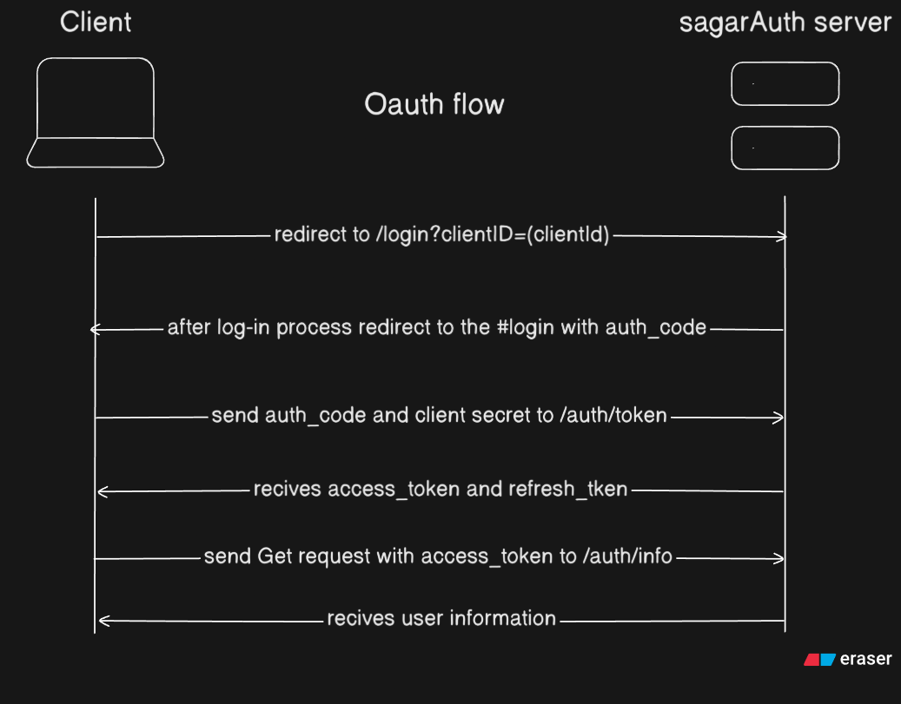

<div
  class="container"
  align="center"
>
 

# 1 Million Checkbox

</div>

<p align="center">
<a href="#"></a>
<a href="#"></a>
<a href="#"></a>
<a href="#"></a>
<a href="#"></a>
<a href="#"></a>
<a href="https://pnpm.io/"></a>

A real-time collaborative app where users across the world can toggle a shared grid of **1,000,000 checkboxes** and see each other's changes instantly.

## Features

- 1,000,000 shared checkboxes synced live across all users
- Login via SagarAuth (OAuth 2.0)
- Live online user count
- Rate limiting max 1 checkbox change every 2 seconds per user
- Horizontal scaling possible

---

## Getting Started

### 1. Start Redis with Docker

The app needs Redis running. So just run:

```bash
docker compose up -d
```

This starts:

- **Redis** on port `6379`
- **RedisInsight** (Redis GUI) on port `8001` → open `http://localhost:8001` to browse data

### 2. Install dependencies

```bash
pnpm i
```

### 3. Set up environment variables

```bash
cp .env.example .env
```

Edit `.env`:

```env
PORT=3000
```

### 4. Start the dev server

```bash
pnpm dev
```

App will be running at → **http://localhost:3000**

## 🗄️ Redis Setup

The `docker-compose.yml` handles everything. Just run `docker compose up -d`.

The app creates **3 Redis connections** internally:

| Connection   | Purpose                                        |
| ------------ | ---------------------------------------------- |
| `redis`      | Read/write checkbox state and user count       |
| `publisher`  | Publish changes to other server instances      |
| `subscriber` | Listen for changes from other server instances |

**Keys stored in Redis:**

| Key              | What it stores                                      |
| ---------------- | --------------------------------------------------- |
| `checkbox-state` | JSON array of 10,000 booleans (the checkbox states) |
| `user-count`     | Number of currently connected users                 |

---

## Auth Flow (SagarAuth OAuth 2.0)

SagarAuth is a custom OAuth provider. Here's how to set it up and how the login flow works.

### Step 0 - Register your app

Go to [sagarauth.sagarkemble.dev](https://sagarauth.sagarkemble.dev) and register your app. You'll get a:

- `clientId`
- `clientSecret`

### Step 1 - User clicks Login

The app redirects the user to SagarAuth with your `clientId`:

```
https://sagarauth.sagarkemble.dev?clientId=YOUR_CLIENT_ID
```

### Step 2 - User signs in on SagarAuth

The user enters their credentials on the SagarAuth page.

### Step 3 - Redirect back with an authorization code

After successful login, SagarAuth redirects the user back to your app:

```
http://localhost:3000#login?code=AUTHORIZATION_CODE
```

The app reads the `code` from the URL hash.

### Step 4 - Exchange the code for tokens

The app sends the `code` + `clientSecret` to SagarAuth's token endpoint:

```
POST https://sagarauth.sagarkemble.dev/auth/token
```

In return, SagarAuth gives back an **access token** and a **refresh token**. These are stored in cookies.

### Step 5 - Fetch user info

The app sends the access token to:

```
GET https://sagarauth.sagarkemble.dev/auth/userinfo
```

This returns the user's profile (name, email, avatar etc.), which is stored and displayed in the UI.



---

## 🔌 WebSocket Flow (Socket.IO)

### On connect

When a user opens the app, they connect via Socket.IO. The server immediately:

1. Increments the connected user count in Redis
2. Sends the full checkbox state array to the client (`onConnect` event)
3. Broadcasts the updated user count to everyone (`userCount` event)

```javascript
socket.on("onConnect", (arr) => {
  checkBoxStateArr = arr;
  renderCheckboxes(arr); // draw all 10,000 checkboxes
  updateCheckboxCounts();
  document.getElementById("loading-screen").classList.add("hidden");
});

socket.on("userCount", (userCount) => {
  document.getElementById("online-count").textContent = userCount;
});
```

### On checkbox toggle

When a user clicks a checkbox, the client sends the **index** and **new state** to the server:

```javascript
// client sends:
socket.emit("checkboxChange", { index: 42, state: true });
```

The server:

1. Checks rate limiting (see below)
2. Validates the index
3. Updates the state in Redis
4. Publishes the change to the Redis Pub/Sub channel

All server instances subscribed to that channel then broadcast the change to their connected clients:

```javascript
// all clients receive:
socket.on("checkboxChange", (data) => {
  const { index, state } = JSON.parse(data);
  checkboxRefs[index].checked = state;
  checkBoxStateArr[index] = state;
  updateCheckboxCounts();
});
```

### Error events

```javascript
socket.on("error", (err) => {
  console.error("Error from server:", err.message);
});

socket.on("server:rateLimitExceeded", () => {
  showToast("Slow down! ");
});
```

### Why Redis Pub/Sub?

When you run multiple server instances (horizontal scaling), each instance handles different clients. Redis Pub/Sub acts as a message bus - one instance publishes a change, all instances receive it and forward it to their own clients. This keeps all users in sync regardless of which server instance they're connected to.

---

## 🛑 Rate Limiting

To prevent users from spamming checkbox changes, a simple **per-user cooldown** is enforced on the server.

### How it works

The server keeps an in-memory `Map` where:

- **Key** = `socket.id` (unique per connection)
- **Value** = timestamp of the user's last checkbox change

When a `checkboxChange` event arrives, the server checks:

```
time elapsed = now - lastOperationTimestamp

if elapsed < 2 seconds → reject and send "rateLimitExceeded" error
else → allow and update the timestamp
```

### In code (server-side)

```typescript
const lastOperationTime = rateLimitingHashMap.get(socket.id);

if (lastOperationTime) {
  const timeElapsed = Date.now() - lastOperationTime;
  if (timeElapsed < 2 * 1000) {
    // less than 2 seconds
    return socket.emit("server:rateLimitExceeded", {
      message: "Rate limit exceeded. Please wait.",
    });
  }
}

rateLimitingHashMap.set(socket.id, Date.now()); // update timestamp
```

### What happens on the client

The client shows a toast notification:

```javascript
socket.on("server:rateLimitExceeded", () => {
  showToast("Slow down! ");
});
```

### Summary

| Parameter         | Value                                            |
| ----------------- | ------------------------------------------------ |
| Cooldown per user | 2 seconds                                        |
| Scope             | Per socket connection                            |
| Storage           | In-memory Map (fast, auto-cleared on disconnect) |

---

## 📁 Project Structure

```
global-checkbox-redis/
├── src/
│   ├── index.ts              # Main server (WebSocket + Express logic)
│   └── redis-connection.ts   # Redis client connections
├── public/
│   └── index.html            # Frontend (HTML + CSS + JS all in one)
├── docker-compose.yml        # Redis + RedisInsight via Docker
├── .env.example              # Environment variable template
├── package.json
└── tsconfig.json
```
